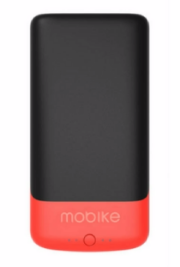
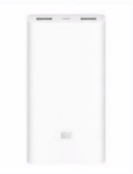
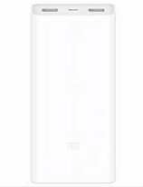
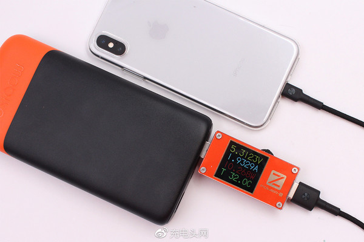

#12摩拜能量芯入手记
@(博客)
我一直有个给chromebook配个大容量充电宝的需求，因为使用的hp chromebook 11，充电口是micro usb，可以跟手机充电器通用，省去了总带着电源头的麻烦，但同时电池不经用的问题，也凸显出来，总是插着电源用，很是不便，这时一个大容量的充电宝的需求就随之而来。双十一的一次推荐，让我知道了摩拜能量芯的存在，而与小米2c电源的对比，让我最终选择了它。

查了些资料，所有的精华都在这张表格了：
### 摩拜能量芯、小米移动电源2、小米移动电源2c对比：
|比较|摩拜能量芯|小米移动电源2|小米移动电源2c|
| :--------: | :--------:| :--: |:--: |
|实物图|||
| 大小  | 165×84×23(mm)|135.5×67.6×23.9(mm) |  149.5×69.6mm×23.9   |
|重量|约400g|330.5g|358g|
|容量|17100mAh(61.9Wh)|20000mAh 3.7V(77Wh）|20000mAh 3.7V(74Wh）|
|电量换算|可为iPhone8充电6.2次，三星S8充电3.8次，小米6充电3.4次，苹果iPad mini充电2.2次（摩拜单车平地8-10公里）|可为iPhone7充电7.1次，小米5充电5.1次，苹果iPad mini 2充电2.5次|可为iPhone7充电7.1次，小米5x充电4.3次，苹果iPad mini 4充电2.5次
|输出|1个usb输出5.0V2.1A/9V2A/12V1.5A MAX150W|2个usb输出5.1V2.4A/9V2A/12V1.5A MAX18W（双口同时快充）|2个usb输出5.1V2.4A/9V2A/12V1.5A MAX18W（双口同时输出的时候，快充功能会被屏蔽）
|充电接口|专用接口（未知）|MicroUSB（充电时，输出仍支持QC快充）|MicroUSB（充电时，输出QC快充被屏蔽）
|充电时间|3.5小时（专用25w充电器，25.2V/1.0A）|6.2小时(快充充电器，9V/2A 12V/1.5A)|6.2小时(快充充电器，9V/2A)
|支持快充|双向快充（输入支持25W快充，输出支持高通3.0快充、华为FCP模式以及联发科PE模式）|双向快充（输出支持高通QC2.0、QC3.0、华为的FCP快充等）|双向快充（输出支持高通QC2.0、QC3.0、华为的FCP快充等）|
|充电保护|12重保护（**输入过电压**、**输出过电压**、**短路防护**、输入过电流、**输出过电流**、**输入放反防护**、防倒流防护、电池过流保护、电池过压保护、自动截流保护、**电池过充放保护**、防静电保护）|9重保护（**输入过电压**、**输出过电压**、**短路保护**、**输出过电流**、**输入放反防护**、温度保护、Reset保护、硬件级电池过流短路保护、**电池过充放保护**）|9重保护（**输入过电压**、**输出过电压**、**短路保护**、**输入放反防护**、**输出过电流**、温度保护、Reset保护、硬件级电池过流短路保护、**电池过充放保护**）
|价格|199元（双11特价149.5元）|149元（下架）|129元|
|退换货|“360天超长退还”服务，60天试用服务，期间无折旧费用，超出60天则收取0.66元/天的折旧费)|7天无理由退货|7天无理由退货
|其他|目前仅销售绍兴地区|京东、天猫、小米商城均无货||

#### 总结：
从中可以看出，最符合我需求的是小米移动电源2，但是一直无货，而在摩拜能量芯和小米移动电源2c之间，外形和重量很接近，而摩拜的充电时间3.5小时，以及未来可能支持单车服务，让我最终选择了它。
 *PS：摩拜能量芯仅售绍兴怎么办？万能的淘宝搜**“跑腿”**。*

对于摩拜能量芯的充电宝功能，已有人做了测试，2A的输出可以到5.3V：

> #### 参考文献：
1、360天可退还、7-15公里续航：mobike 摩拜 推出 “摩拜能量芯” 移动电源
https://news.m.smzdm.com/p/34534
2、有赞摩拜商城https://detail.youzan.com/show/goods?alias=3nhvzeagsv14b&sf=wx_sm&redirect_count=1&from=singlemessage&isappinstalled=0
3、129元值不值得买？小米移动电源2C 20000mAh 拆解评测http://baijiahao.baidu.com/s?id=1578980724734720593&wfr=spider&for=pc
4、小米商城：小米移动电源2 http://home.mi.com/shop/detail?gid=413、小米移动电源2c https://www.mi.com/battery2c/
5、摩拜单车推充电宝周边 https://tech.sina.cn/2017-11-19/detail-ifynwxum5025997.d.html